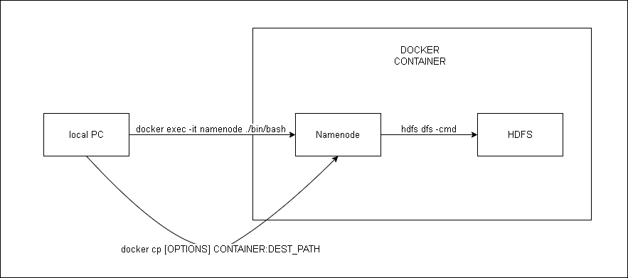

Pour utiliser APACHE Hadoop en déployant des conteneurs Docker, il faut commencer par cloner la structure de base.
### 0) Initialiser les conteneurs Docker

```
git clone https://github.com/big-data-europe/docker-hadoop.git
```

Et pour déployer le .yml de Docker, nous utilisons la commande :

```
docker-compose up -d
```

Pour regarder toutes les containers ouverts, nous pouvons regarder sur Docker Desktop ou nous pouvons utiliser:
```
docker ps 
```


La structure du système est la suivante, avec les commandes de connexion :


Nous utilisons ensuite le lien suivant pour ouvrir une console dans le conteneur nodename.

```
docker exec -it namenode ./bin/bash
```
Il faut utiliser *-it* to mantenir la console ouvert.

### 1) Initialiser le conteneur du nœud HDFS
Nous pouvons créer des dossiers pour séparer les différents fichiers dans HDFS :

```
# Dans la console de nodename.
hdfs dfs -mkdir /user/root/input
hdfs dfs -mkdir /user/root/output
```


### 2) Insertion des données dans le nœud
Depuis la console de la machine locale, nous pouvons utiliser la commande *docker cp* :

```
docker cp rousseauonline.txt namenode:/    
docker cp hadoop_test-1.0-SNAPSHOT.jar namenode:/
```
Ainsi, nous pouvons ajouter les deux fichiers qui nous intéressent, le fichier d'exécution *jar* et le fichier d'entrée *.txt*.
Le fichier .jar peut être obtenu en utilisant la commande *mvn package* dans un projet MAVEN.

### 3) Insertion des données dans HDFS
Depuis la console du conteneur nodename, nous pouvons utiliser la commande *hdfs dfs -put* :

```
hdfs dfs -put rousseauonline.txt /user/root/input
```


### 4) Lancement de Map Reduce
Pour exécuter le MapReduce à partir du fichier jar, il suffit de lancer la commande suivante dans le conteneur nodename :

```
hadoop jar hadoop_test-1.0-SNAPSHOT.jar org.apache.hadoop.examples.WordCount input output  
```
Cette exécution peut prendre un certain temps.

### 5) Affichage des données
Depuis la console du conteneur nodename, nous pouvons utiliser la commande *hadoop fs -cat file* :

```
# Dans notre cas le fichier à le nom part-r-00000.
hadoop fs -cat output/part-r-00000
```

### 6) Récupérer le résultat en local
Il faut utiliser les commandes suivantes :
* Dans la console du conteneur nodenmame.
```
hdfs dfs -copyToLocal <hdfs_file_name> <local_path>
```
* Dans la console local.
```
docker cp namenode:/data/ ../
```
Vous pouvez retrouver le resoult dans: DATA831_TP1_HADOOP\data\part-r-00000.txt
